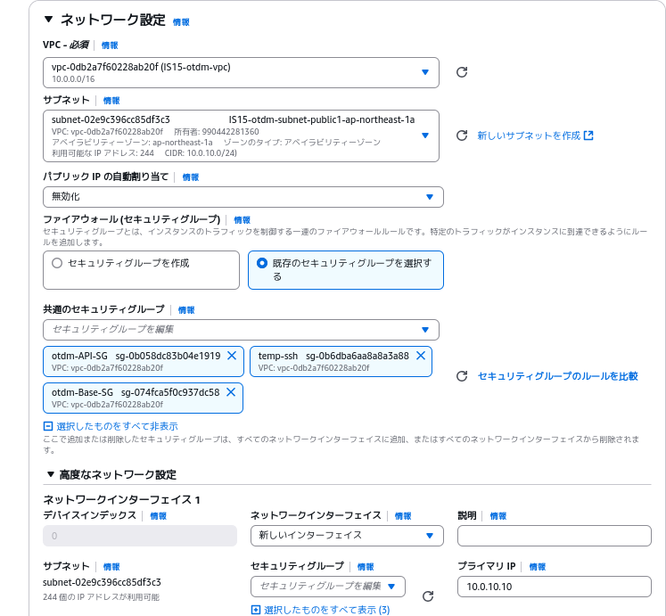

# 環境構築手順
以下の項目を指定してAWSでEC2インスタンスを構築する
* 名前：API
* AMI：ami-0d9da98839203a9d1
* インスタンスタイプ：t3.small
* キーペア：自身の使用するもの
* ネットワーク設定：



* ストレージ設定：8GB

ElasticIP:35.73.31.183を関連付け
SSH接続
```
ssh ec2-user@35.73.31.183
```
インストールと設定を入れる
```
sudo useradd -m apiuser
echo "apiuser ALL=(ALL)       ALL" | sudo tee /etc/sudoers.d/apiuser
sudo chmod 0440 /etc/sudoers.d/apiuser
sudo passwd apiuser
```
パスワードを入力
```
sudo su - apiuser 
```
```
sudo -u apiuser mkdir -p /home/apiuser/.ssh
sudo -u apiuser chmod 700 /home/apiuser/.ssh
echo "ssh-ed25519 AAAAC3NzaC1lZDI1NTE5AAAAIICw4ZzLPjsKazxZUhnk81ODO4WrYelXacg5717HDQJZ managementuser@management-server" | sudo tee -a /home/apiuser/.ssh/authorized_keys
sudo chmod 600 /home/apiuser/.ssh/authorized_keys
sudo chown -R apiuser:apiuser /home/apiuser/.ssh
sudo dnf update -y 
sudo dnf upgrade -y 
curl --proto '=https' --tlsv1.2 -sSf https://sh.rustup.rs | sh
source $HOME/.cargo/env
sudo dnf install -y gcc openssl-devel pkgconfig
sudo dnf install python3-pip -y
pip install cqlsh
```
以下のように表示されるためEnterを押下
```
1) Proceed with standard installation (default - just press enter)
2) Customize installation
3) Cancel installation
>
```
**これ以降の手順はManagementServerの構築後に行ってください**
SSH接続を一旦退出
```
exit
```

```
exit
```
以下の表示が出ればOK
```
Connection to 35.73.31.183 closed.
```

ManagementServer経由でSSH接続
```
ssh managementuser@<ManagementServerのIPアドレス> -p 2455
```
**初回のみ**
```
ssh apiuser@10.0.10.10
```
```
exit
```
**初回のみここまで**
```
ssh db
```

APIServer動作プログラムの作成
```
cargo new apiserver
cd apiserver
```
以上APIServerの構築・ログイン手順は終了です。