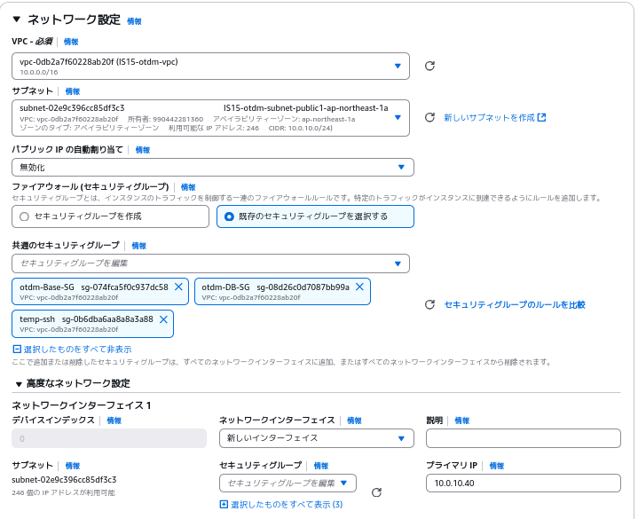

# DBServerの環境構築手順
以下の項目を指定してAWSでEC2インスタンスを構築する
    * 名前：DBServer
    * AMI：ami-0d9da98839203a9d1
    * インスタンスタイプ：t3.medium
    * キーペア：自身の使用するもの
    * ネットワーク設定：

    
    * ストレージ設定：8GB

ElasticIP:54.65.115.124を関連付け
SSH接続
```
ssh ec2-user@54.65.115.124
```
インストールと設定を入れる
```
sudo useradd -m dbuser
echo "dbuser ALL=(ALL)       ALL" | sudo tee /etc/sudoers.d/dbuser
sudo chmod 0440 /etc/sudoers.d/dbuser
sudo passwd dbuser
```
パスワードを入力
```
sudo su - dbuser 
```


```
sudo -u dbuser mkdir -p /home/dbuser/.ssh
sudo -u dbuser chmod 700 /home/dbuser/.ssh
echo "ssh-ed25519 AAAAC3NzaC1lZDI1NTE5AAAAIICw4ZzLPjsKazxZUhnk81ODO4WrYelXacg5717HDQJZ managementuser@management-server" | sudo tee -a /home/dbuser/.ssh/authorized_keys
sudo chmod 600 /home/dbuser/.ssh/authorized_keys
sudo chown -R dbuser:dbuser /home/dbuser/.ssh
sudo dnf update -y 
sudo dnf upgrade -y
sudo dnf install -y java-11-openjdk
sudo dnf install python3-pip -y
pip install cqlsh 
sudo dnf install chkconfig -y 
curl --proto '=https' --tlsv1.2 -sSf https://sh.rustup.rs | sh
source $HOME/.cargo/env
sudo tee /etc/yum.repos.d/cassandra.repo <<EOF
[cassandra]
name=Apache Cassandra
baseurl=https://redhat.cassandra.apache.org/41x/
gpgcheck=1
repo_gpgcheck=1
gpgkey=https://downloads.apache.org/cassandra/KEYS
EOF
sudo dnf install cassandra -y
sudo mv /etc/cassandra/conf/cassandra.yaml /etc/cassandra/conf/cassandra.yaml.bk
sudo tee /etc/cassandra/conf/cassandra.yaml <<EOF
cluster_name: 'Test Cluster'
num_tokens: 16
allocate_tokens_for_local_replication_factor: 3
hinted_handoff_enabled: true
max_hint_window: 3h
hinted_handoff_throttle: 1024KiB
max_hints_delivery_threads: 2
hints_directory: /var/lib/cassandra/hints
hints_flush_period: 10000ms
max_hints_file_size: 128MiB
auto_hints_cleanup_enabled: false
batchlog_replay_throttle: 1024KiB
authenticator: AllowAllAuthenticator
authorizer: AllowAllAuthorizer
role_manager: CassandraRoleManager
network_authorizer: AllowAllNetworkAuthorizer
roles_validity: 2000ms
permissions_validity: 2000ms
credentials_validity: 2000ms
partitioner: org.apache.cassandra.dht.Murmur3Partitioner
data_file_directories:
    - /var/lib/cassandra/data
commitlog_directory: /var/lib/cassandra/commitlog
cdc_enabled: false
disk_failure_policy: stop
commit_failure_policy: stop
prepared_statements_cache_size:
key_cache_size:
key_cache_save_period: 4h
row_cache_size: 0MiB
row_cache_save_period: 0s
counter_cache_size:
counter_cache_save_period: 7200s
saved_caches_directory: /var/lib/cassandra/saved_caches
commitlog_sync: periodic
commitlog_sync_period: 10000ms
commitlog_segment_size: 32MiB
seed_provider:
  - class_name: org.apache.cassandra.locator.SimpleSeedProvider
    parameters:
      - seeds: "54.65.115.124:7000"
concurrent_reads: 32
concurrent_writes: 32
concurrent_counter_writes: 32
concurrent_materialized_view_writes: 32
memtable_allocation_type: heap_buffers
index_summary_capacity:
index_summary_resize_interval: 60m
trickle_fsync: false
trickle_fsync_interval: 10240KiB
storage_port: 7000
ssl_storage_port: 7001
listen_address: 10.0.10.40 
broadcast_address: 54.65.115.124
start_native_transport: true
native_transport_port: 9042
native_transport_allow_older_protocols: true
rpc_address: 0.0.0.0
broadcast_rpc_address: 54.65.115.124
rpc_keepalive: true
incremental_backups: false
snapshot_before_compaction: false
auto_snapshot: true
snapshot_links_per_second: 0
column_index_size: 64KiB
column_index_cache_size: 2KiB
concurrent_materialized_view_builders: 1
compaction_throughput: 64MiB/s
sstable_preemptive_open_interval: 50MiB
uuid_sstable_identifiers_enabled: false
read_request_timeout: 5000ms
range_request_timeout: 10000ms
write_request_timeout: 2000ms
counter_write_request_timeout: 5000ms
cas_contention_timeout: 1000ms
truncate_request_timeout: 60000ms
request_timeout: 10000ms
slow_query_log_timeout: 500ms
endpoint_snitch: SimpleSnitch
dynamic_snitch_update_interval: 100ms
dynamic_snitch_reset_interval: 600000ms
dynamic_snitch_badness_threshold: 1.0
server_encryption_options:
  internode_encryption: none
  legacy_ssl_storage_port_enabled: false
  keystore: conf/.keystore
  keystore_password: cassandra
  require_client_auth: false
  truststore: conf/.truststore
  truststore_password: cassandra
  require_endpoint_verification: false
client_encryption_options:
  enabled: false
  keystore: conf/.keystore
  keystore_password: cassandra
  require_client_auth: false
internode_compression: dc
inter_dc_tcp_nodelay: false
trace_type_query_ttl: 1d
trace_type_repair_ttl: 7d
user_defined_functions_enabled: false
scripted_user_defined_functions_enabled: false
transparent_data_encryption_options:
  enabled: false
  chunk_length_kb: 64
  cipher: AES/CBC/PKCS5Padding
  key_alias: testing:1
  key_provider:
    - class_name: org.apache.cassandra.security.JKSKeyProvider
      parameters:
        - keystore: conf/.keystore
          keystore_password: cassandra
          store_type: JCEKS
          key_password: cassandra
tombstone_warn_threshold: 1000
tombstone_failure_threshold: 100000
replica_filtering_protection:
    cached_rows_warn_threshold: 2000
    cached_rows_fail_threshold: 32000
batch_size_warn_threshold: 5KiB
batch_size_fail_threshold: 50KiB
unlogged_batch_across_partitions_warn_threshold: 10
compaction_large_partition_warning_threshold: 100MiB
compaction_tombstone_warning_threshold: 100000
audit_logging_options:
  enabled: false
  logger:
    - class_name: BinAuditLogger
diagnostic_events_enabled: false
repaired_data_tracking_for_range_reads_enabled: false
repaired_data_tracking_for_partition_reads_enabled: false
report_unconfirmed_repaired_data_mismatches: false
materialized_views_enabled: false
sasi_indexes_enabled: false
transient_replication_enabled: false
drop_compact_storage_enabled: false
EOF
sudo systemctl daemon-reload
sudo systemctl restart cassandra
```
以下のように表示されるためEnterを押下
```
1) Proceed with standard installation (default - just press enter)
2) Customize installation
3) Cancel installation
>
```
**cqlshの再起動直後はCQLSHに接続できないです。30秒ほど待てばつながるようになります。**
```
cqlsh
```
接続後
```
CREATE KEYSPACE IF NOT EXISTS customer_data WITH replication = {'class': 'SimpleStrategy', 'replication_factor': 1};
SELECT * FROM system_schema.keyspaces;
USE customer_data;
CREATE TABLE IF NOT EXISTS customer_info (
    customer_id INT PRIMARY KEY,        -- 顧客ID（一意）
    client_public_key TEXT,             -- 顧客環境の公開鍵
    server_public_key TEXT,             -- サーバ群の公開鍵
    subdomain TEXT,                     -- 生成したサブドメイン
    vpn_ip_server TEXT,                 -- VPN用のIPアドレス（サーバ群用）
    vpn_ip_client TEXT,                 -- VPN用のIPアドレス（顧客環境用）
    created_at TIMESTAMP                -- データ作成日時
);
```
