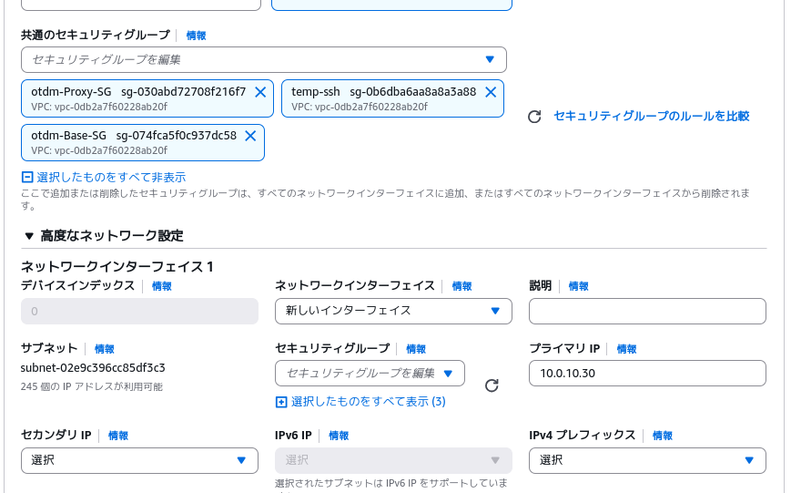

# ProxyServerの環境構築手順
以下の項目を指定してAWSでEC2インスタンスを構築する
* 名前：Proxy
* AMI：ami-0d9da98839203a9d1
* インスタンスタイプ：t3.micro
* キーペア：自身の使用するもの
* ネットワーク設定：


    
* ストレージ設定：8GB

ElasticIP:54.65.115.124を関連付け
SSH接続
```
ssh ec2-user@54.92.7.121
```
インストールと設定を入れる
```
sudo useradd -m proxyuser
echo "proxyuser ALL=(ALL)       ALL" | sudo tee /etc/sudoers.d/proxyuser
sudo chmod 0440 /etc/sudoers.d/proxyuser
sudo passwd proxyuser
```
パスワードを入力
```
sudo su - proxyuser 
```
```
sudo -u proxyuser mkdir -p /home/proxyuser/.ssh
sudo -u proxyuser chmod 700 /home/proxyuser/.ssh
echo "ssh-ed25519 AAAAC3NzaC1lZDI1NTE5AAAAIICw4ZzLPjsKazxZUhnk81ODO4WrYelXacg5717HDQJZ managementuser@management-server" | sudo tee -a /home/proxyuser/.ssh/authorized_keys
sudo chmod 600 /home/proxyuser/.ssh/authorized_keys
sudo chown -R proxyuser:proxyuser /home/proxyuser/.ssh
sudo dnf update -y
sudo dnf install -y haproxy
sudo dnf install curl -y
curl --proto '=https' --tlsv1.2 -sSf https://sh.rustup.rs | sh
source $HOME/.cargo/env
cargo new proxyserver
cd proxyserver
sudo dnf install -y gcc openssl-devel pkgconfig
sudo dnf install python3-pip -y
pip install cqlsh
sudo chmod 666 /etc/haproxy/haproxy.cfg
sudo systemctl restart haproxy
sudo systemctl enable haproxy
sudo chmod o+w /etc/haproxy/haproxy.cfg
```
以下のように表示されるためEnterを押下
```
1) Proceed with standard installation (default - just press enter)
2) Customize installation
3) Cancel installation
>
```
DBへの接続確認のため30秒ほど待機
```
cqlsh 10.0.10.40
```
CQLSHから退出
```
exit
```
**これ以降の手順はManagementServerの構築後に行ってください**
SSH接続を一旦退出
```
exit
```
```
exit
```
以下の表示が出ればOK
```
Connection to 54.92.7.121 closed.
```
ManagementServer経由でSSH接続
```
ssh managementuser@<ManagementServerのIPアドレス> -p 2455
```
**初回のみ**
```
ssh proxyuser@10.0.10.30
```
```
exit
```
**初回のみここまで**
```
ssh proxy
```
gitからプログラムコードを移行
Cargo.tomlも移行


以上でProxyServerの構築・ログイン手順は終了です。
