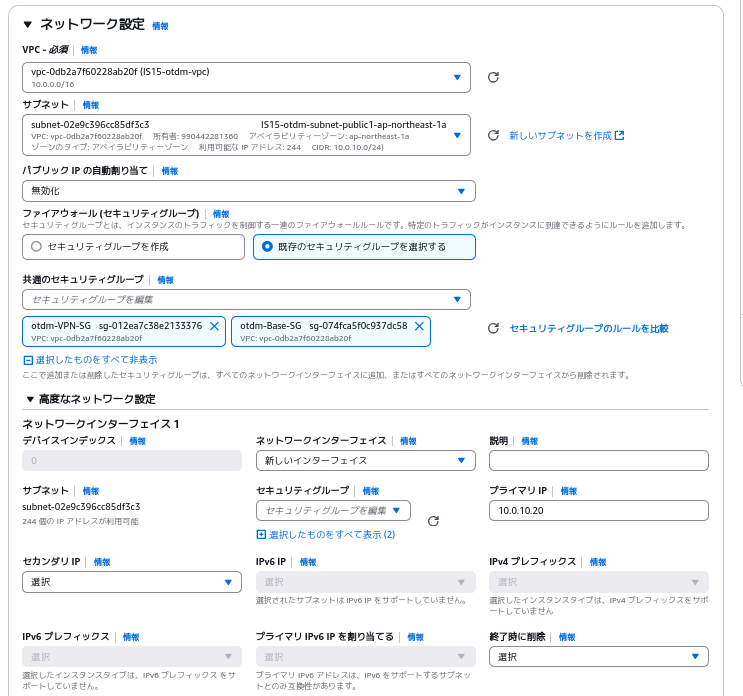

# VPNServer構築手順
以下の項目を指定してAWSでEC2インスタンスを構築する
* 名前：VPN
* AMI：ami-0d9da98839203a9d1
* インスタンスタイプ：t3.small
* キーペア：自身の使用するもの
* ネットワーク設定：



* ストレージ設定：8GB
ElasticIP:54.178.75.68を関連付け
SSH接続
```
ssh ec2-user@35.73.31.183
```
インストールと設定を入れる
```
sudo useradd -m vpnuser
echo "vpnuser ALL=(ALL)       ALL" | sudo tee /etc/sudoers.d/vpnuser
sudo chmod 0440 /etc/sudoers.d/vpnuser
sudo passwd vpnuser
```
パスワードを入力
```
sudo su - vpnuser 
```
以下のコマンドを実行
```
sudo dnf upgrade -y
sudo dnf install -y epel-release
sudo dnf install -y wireguard-tools
sudo mkdir -p /home/vpnserver/.ssh
sudo chmod 700 /home/vpnserver/.ssh
curl --proto '=https' --tlsv1.2 -sSf https://sh.rustup.rs | sh
source $HOME/.cargo/env
sudo dnf install -y gcc
cargo new vpnserver
cd vpnserver
sudo dnf install python3-pip -y
pip install cqlsh
echo "ssh-ed25519 AAAAC3NzaC1lZDI1NTE5AAAAIICw4ZzLPjsKazxZUhnk81ODO4WrYelXacg5717HDQJZ managementuser@management-server" | sudo tee -a /home/vpnserver/.ssh/authorized_keys
sudo chmod 600 /home/vpnserver/.ssh/authorized_keys
sudo chown -R vpnserver:vpnserver /home/vpnserver/.ssh
chmod +x add_peer.sh 
chmod +x read_config.sh
echo "vpnuser ALL=(ALL)       ALL"  | sudo tee -a /etc/sudoers
echo "vpnuser ALL=(ALL) NOPASSWD: /bin/echo >> /etc/wireguard/wg0.conf"  | sudo tee -a /etc/sudoers
```
以下のように表示されるためEnterを押下
```
1) Proceed with standard installation (default - just press enter)
2) Customize installation
3) Cancel installation
>
```
**これ以降の手順はManagementServerの構築後に行ってください**
SSH接続を一旦退出
```
exit
```
以下の表示が出ればOK
```
Connection to 54.178.75.68 closed.
```
ManagementServer経由でSSH接続
```
ssh managementuser@<ManagementServerのIPアドレス> -p 2455
```
**初回のみ**
```
ssh vpnuser@10.0.10.20
```
```
exit
```
**初回のみここまで**
```
ssh vpn
```
gitからプログラムコードを移行
Cargo.tomlも移行


以上でVPNServerの構築・ログイン手順は終了です。